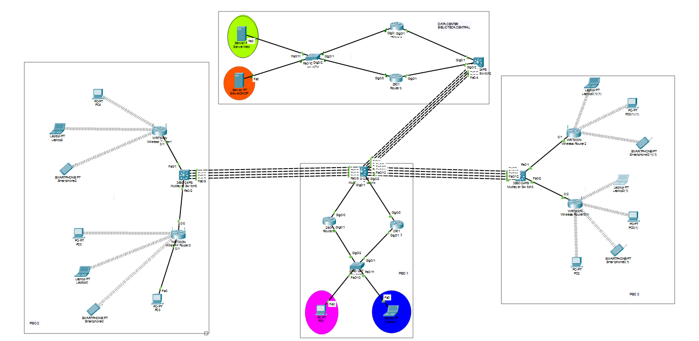

# Práctica 2 - Redes de Computadoras 2
## La Facultad de Ingeniería y su problema de conectividad en la biblioteca

**Universidad San Carlos de Guatemala**  
**Facultad de Ingeniería**  
**Ingeniería en Ciencias y Sistemas**  
**Primer Semestre 2026**

---

## Integrantes - Grupo 5

| Nombre | Carnet |
|--------|--------|
| Estiben Yair Lopez Leveron | 202204578 |
| Johan Moises Cardona Rosales | 202201405 |
| Giovanni Saul Concoha Cax | 202100229 |

---

## Índice

1. [Topología Propuesta](#1-topología-propuesta)
2. [VLANs Configuradas](#2-vlans-configuradas)
3. [Subnetting Detallado](#3-subnetting-detallado)
4. [Configuración de Switches](#4-configuración-de-switches)
5. [Configuración de Routers Piso 1 y HSRP](#5-configuración-de-routers-piso-1-y-hsrp)
6. [Configuración de Routers Data Center y HSRP](#6-configuración-de-routers-data-center-y-hsrp)
7. [Configuración LACP](#7-configuración-lacp)
8. [Configuración EIGRP](#8-configuración-eigrp)
9. [Configuraciones DHCP](#9-configuraciones-dhcp)
10. [Configuración Inalámbrica](#10-configuración-inalámbrica)
11. [Configuración DNS y HTTP del Servidor Web](#11-configuración-dns-y-http-del-servidor-web)
12. [Verificación de Conectividad](#12-verificación-de-conectividad)

---

## 1. Topología Propuesta




La red está dividida en cuatro áreas principales interconectadas mediante enlaces LACP:


### Dispositivos y sus roles

| Dispositivo | Rol | IP Principal |
|---|---|---|
| ServerWeb | DNS + HTTP | 192.198.35.10 |
| ServerDHCP | DHCP Centralizado | 192.198.45.10 |
| Switch3 | Acceso Data Center | - |
| Router2 | HSRP Active Data Center | 192.198.35.2 / 192.198.45.2 |
| Router3 | HSRP Standby Data Center | 192.198.35.3 / 192.198.45.3 |
| MultilayerSwitch2 | Core Data Center | 10.2.7.2 (Po1) |
| MultilayerSwitch4 | Core Piso 1 | 10.2.7.1 (Po1) |
| Router1 | HSRP Active Piso 1 | 10.2.5.2 |
| Router0 | HSRP Standby Piso 1 | 10.2.5.6 |
| Switch0 | Acceso Piso 1 | - |
| PC1 | Host VLAN 15 (ADMIN) | DHCP |
| Laptop1 | Host VLAN 25 (ESTUDIANTES) | DHCP |
| MultilayerSwitch0 | Core Piso 2 | 10.2.8.2 (Po2) |
| Wireless Router1 | AP WLAN1 Piso 2 | LAN: 192.198.25.126 |
| Wireless Router0 | AP WLAN2 Piso 2 | LAN: 192.198.25.254 |
| MultilayerSwitch3 | Core Piso 3 | 10.2.9.2 (Po3) |
| Wireless Router2 | AP WLAN1 Piso 3 | LAN: 192.198.35.1 |
| Wireless Router0(1) | AP WLAN2 Piso 3 | LAN: 192.198.35.129 |

---

## 2. VLANs Configuradas

### Tabla de VLANs (Grupo 5)

| ID VLAN | Nombre | Descripción |
|---|---|---|
| 15 | ADMIN | Administración Piso 1 (10 + 5 = 15) |
| 25 | ESTUDIANTES | Estudiantes Piso 1 (20 + 5 = 25) |
| 35 | WEB_SERVERS | Servidores Web Data Center (30 + 5 = 35) |
| 45 | DHCP_SERVERS | Servidores DHCP Data Center (40 + 5 = 45) |

### Cálculo del número de grupo
```
Grupo 5 → X = 5
ADMIN       = 10 + 5 = 15
ESTUDIANTES = 20 + 5 = 25
WEB_SERVERS = 30 + 5 = 35
DHCP_SERVERS= 40 + 5 = 45
```

---

## 3. Subnetting Detallado

### 3.1 VLSM - Piso 1 (Red base: 192.198.15.0/24)

Se aplica VLSM porque los dos segmentos tienen diferente cantidad de hosts.

#### VLAN 25 - ESTUDIANTES (60 hosts)
```
Red requerida  : 60 hosts → necesita /26 (62 hosts útiles)
Red            : 192.198.15.0/26
Máscara        : 255.255.255.192
Rango hosts    : 192.198.15.1 - 192.198.15.62
Broadcast      : 192.198.15.63
Gateway (VIP)  : 192.198.15.2
Router1        : 192.198.15.1
Router0        : 192.198.15.3
```

#### VLAN 15 - ADMIN (10 hosts)
```
Red requerida  : 10 hosts → necesita /28 (14 hosts útiles)
Red            : 192.198.15.64/28
Máscara        : 255.255.255.240
Rango hosts    : 192.198.15.65 - 192.198.15.78
Broadcast      : 192.198.15.79
Gateway (VIP)  : 192.198.15.66
Router1        : 192.198.15.65
Router0        : 192.198.15.67
```

### 3.2 FLSM - Piso 2 (Red base: 192.198.25.0/24)

Se aplica FLSM porque ambos segmentos tienen igual cantidad de hosts (80 cada uno).

```
Red base       : 192.198.25.0/24
División       : 2 subredes de /25 (126 hosts útiles cada una)
```

#### WLAN1 Piso 2 (80 hosts)
```
Red            : 192.198.25.0/25
Máscara        : 255.255.255.128
Rango hosts    : 192.198.25.1 - 192.198.25.126
Broadcast      : 192.198.25.127
Gateway (LAN)  : 192.198.25.126 (Wireless Router1)
MLS0 Fa0/1     : 192.198.25.125
DHCP Start     : 192.198.25.2
```

#### WLAN2 Piso 2 (80 hosts)
```
Red            : 192.198.25.128/25
Máscara        : 255.255.255.128
Rango hosts    : 192.198.25.129 - 192.198.25.254
Broadcast      : 192.198.25.255
Gateway (LAN)  : 192.198.25.254 (Wireless Router0)
MLS0 Fa0/2     : 192.198.25.253
DHCP Start     : 192.198.25.130
```

### 3.3 FLSM - Piso 3 (Red base: 192.198.35.0/24)

```
Red base       : 192.198.35.0/24
División       : 2 subredes de /25 (126 hosts útiles cada una)
```

#### WLAN1 Piso 3 (80 hosts)
```
Red            : 192.198.35.0/25
Máscara        : 255.255.255.128
Rango hosts    : 192.198.35.1 - 192.198.35.126
Broadcast      : 192.198.35.127
Gateway (LAN)  : 192.198.35.1 (Wireless Router2)
MLS3 Fa0/1 WAN : 10.2.11.1
DHCP Start     : 192.198.35.2
```

#### WLAN2 Piso 3 (80 hosts)
```
Red            : 192.198.35.128/25
Máscara        : 255.255.255.128
Rango hosts    : 192.198.35.129 - 192.198.35.254
Broadcast      : 192.198.35.255
Gateway (LAN)  : 192.198.35.129 (Wireless Router0(1))
MLS3 Fa0/2 WAN : 10.2.11.5
DHCP Start     : 192.198.35.130
```

### 3.4 Data Center (Red base: 192.198.100.0/24 dividida en 2)

```
Red base       : 192.198.100.0/24
División       : 2 subredes de /25

VLAN 35 WEB_SERVERS  → 192.198.35.0/24  (implementado como /24 completo)
VLAN 45 DHCP_SERVERS → 192.198.45.0/24  (implementado como /24 completo)
```

### 3.5 Red de Enrutamiento (10.2.x.0/24)

Todos los enlaces punto a punto usan /30 (2 hosts útiles).

| Red | Máscara | IP1 | IP2 | Enlace |
|---|---|---|---|---|
| 10.2.5.0/30 | 255.255.255.252 | 10.2.5.1 (MLS4) | 10.2.5.2 (Router1) | MLS4 ↔ Router1 |
| 10.2.5.4/30 | 255.255.255.252 | 10.2.5.5 (MLS4) | 10.2.5.6 (Router0) | MLS4 ↔ Router0 |
| 10.2.6.0/30 | 255.255.255.252 | 10.2.6.1 (MLS2) | 10.2.6.2 (Router2) | MLS2 ↔ Router2 |
| 10.2.6.4/30 | 255.255.255.252 | 10.2.6.5 (MLS2) | 10.2.6.6 (Router3) | MLS2 ↔ Router3 |
| 10.2.7.0/30 | 255.255.255.252 | 10.2.7.1 (MLS4) | 10.2.7.2 (MLS2) | MLS4 ↔ MLS2 (Po1) |
| 10.2.8.0/30 | 255.255.255.252 | 10.2.8.1 (MLS4) | 10.2.8.2 (MLS0) | MLS4 ↔ MLS0 (Po2) |
| 10.2.9.0/30 | 255.255.255.252 | 10.2.9.1 (MLS4) | 10.2.9.2 (MLS3) | MLS4 ↔ MLS3 (Po3) |
| 10.2.10.0/30 | 255.255.255.252 | 10.2.10.1 (MLS0) | 10.2.10.2 (WR1) | MLS0 ↔ Wireless Router1 |
| 10.2.10.4/30 | 255.255.255.252 | 10.2.10.5 (MLS0) | 10.2.10.6 (WR0) | MLS0 ↔ Wireless Router0 |
| 10.2.11.0/30 | 255.255.255.252 | 10.2.11.1 (MLS3) | 10.2.11.2 (WR2) | MLS3 ↔ Wireless Router2 |
| 10.2.11.4/30 | 255.255.255.252 | 10.2.11.5 (MLS3) | 10.2.11.6 (WR0(1)) | MLS3 ↔ Wireless Router0(1) |

---

## 4. Configuración de Switches

### 4.1 Switch3 (Data Center)

```bash
enable
conf t
hostname Switch3

! Crear VLANs
vlan 35
 name WEB_SERVERS
vlan 45
 name DHCP_SERVERS

! Puerto hacia ServerWeb → VLAN 35
interface FastEthernet0/11
 switchport access vlan 35
 switchport mode access

! Puerto hacia ServerDHCP → VLAN 45
interface FastEthernet0/10
 switchport access vlan 45
 switchport mode access

! Trunk hacia Router2
interface GigabitEthernet0/1
 switchport mode trunk

! Trunk hacia Router3
interface GigabitEthernet0/2
 switchport mode trunk

end
write
```

### 4.2 Switch0 (Acceso Piso 1)

```bash
enable
conf t
hostname Switch0

! Crear VLANs
vlan 15
 name ADMIN
vlan 25
 name ESTUDIANTES

! Puerto hacia PC1 → VLAN 15 (ADMIN)
interface FastEthernet0/10
 switchport access vlan 15
 switchport mode access

! Puerto hacia Laptop1 → VLAN 25 (ESTUDIANTES)
interface FastEthernet0/11
 switchport access vlan 25
 switchport mode access

! Trunk hacia Router1
interface GigabitEthernet0/2
 switchport mode trunk
 switchport trunk allowed vlan 1,15,25

! Trunk hacia Router0
interface GigabitEthernet0/1
 switchport mode trunk
 switchport trunk allowed vlan 1,15,25

end
write
```

### 4.3 MultilayerSwitch4 (Core Piso 1)

```bash
enable
conf t
hostname MultilayerSwitch4

! Habilitar routing de capa 3
ip routing

! Crear VLANs
vlan 15
 name ADMIN
vlan 25
 name ESTUDIANTES
vlan 35
 name WEB_SERVERS
vlan 45
 name DHCP_SERVERS

! SVIs para inter-VLAN routing
interface Vlan1
 no ip address
 shutdown

interface Vlan15
 mac-address 0002.1633.6501
 ip address 192.198.15.66 255.255.255.240
 ip helper-address 192.198.45.10

interface Vlan25
 mac-address 0002.1633.6502
 ip address 192.198.15.2 255.255.255.192
 ip helper-address 192.198.45.10

! LACP hacia MultilayerSwitch2 (Data Center) - Po1
interface FastEthernet0/1
 no switchport
 no ip address
 channel-group 1 mode active
interface FastEthernet0/2
 no switchport
 no ip address
 channel-group 1 mode active
interface FastEthernet0/3
 no switchport
 no ip address
 channel-group 1 mode active
interface FastEthernet0/4
 no switchport
 no ip address
 channel-group 1 mode active

interface Port-channel1
 no switchport
 ip address 10.2.7.1 255.255.255.252

! LACP hacia MultilayerSwitch0 (Piso 2) - Po2
interface FastEthernet0/5
 no switchport
 no ip address
 channel-group 2 mode active
interface FastEthernet0/6
 no switchport
 no ip address
 channel-group 2 mode active
interface FastEthernet0/7
 no switchport
 no ip address
 channel-group 2 mode active
interface FastEthernet0/8
 no switchport
 no ip address
 channel-group 2 mode active

interface Port-channel2
 no switchport
 ip address 10.2.8.1 255.255.255.252

! LACP hacia MultilayerSwitch3 (Piso 3) - Po3
interface FastEthernet0/9
 no switchport
 no ip address
 channel-group 3 mode active
interface FastEthernet0/10
 no switchport
 no ip address
 channel-group 3 mode active
interface FastEthernet0/11
 no switchport
 no ip address
 channel-group 3 mode active
interface FastEthernet0/12
 no switchport
 no ip address
 channel-group 3 mode active

interface Port-channel3
 no switchport
 ip address 10.2.9.1 255.255.255.252

! Enlace punto a punto hacia Router1
interface GigabitEthernet0/1
 no switchport
 ip address 10.2.5.1 255.255.255.252
 duplex auto
 speed auto

! Enlace punto a punto hacia Router0
interface GigabitEthernet0/2
 no switchport
 ip address 10.2.5.5 255.255.255.252
 duplex auto
 speed auto

! EIGRP
router eigrp 5
 network 10.2.5.0 0.0.0.255
 network 10.2.7.0 0.0.0.3
 network 10.2.8.0 0.0.0.3
 network 10.2.9.0 0.0.0.3
 network 192.198.15.0
 no auto-summary

end
write
```

### 4.4 MultilayerSwitch2 (Core Data Center)

```bash
enable
conf t
hostname MultilayerSwitch2

ip routing

! Crear VLANs
vlan 35
 name WEB_SERVERS
vlan 45
 name DHCP_SERVERS

! LACP hacia MultilayerSwitch4 - Po1
interface FastEthernet0/1
 no switchport
 no ip address
 channel-group 1 mode active
interface FastEthernet0/2
 no switchport
 no ip address
 channel-group 1 mode active
interface FastEthernet0/3
 no switchport
 no ip address
 channel-group 1 mode active
interface FastEthernet0/4
 no switchport
 no ip address
 channel-group 1 mode active

interface Port-channel1
 no switchport
 ip address 10.2.7.2 255.255.255.252

! Enlace hacia Router2
interface GigabitEthernet0/1
 no switchport
 ip address 10.2.6.1 255.255.255.252
 duplex auto
 speed auto

! Enlace hacia Router3
interface GigabitEthernet0/2
 no switchport
 ip address 10.2.6.5 255.255.255.252
 duplex auto
 speed auto

! EIGRP
router eigrp 5
 network 10.2.6.0 0.0.0.3
 network 10.2.6.4 0.0.0.3
 network 10.2.7.0 0.0.0.3
 no auto-summary

end
write
```

### 4.5 MultilayerSwitch0 (Core Piso 2)

```bash
enable
conf t
hostname MultilayerSwitch0

ip routing

! LACP hacia MultilayerSwitch4 - Po2
interface FastEthernet0/5
 no switchport
 no ip address
 channel-group 2 mode active
interface FastEthernet0/6
 no switchport
 no ip address
 channel-group 2 mode active
interface FastEthernet0/7
 no switchport
 no ip address
 channel-group 2 mode active
interface FastEthernet0/8
 no switchport
 no ip address
 channel-group 2 mode active

interface Port-channel2
 no switchport
 ip address 10.2.8.2 255.255.255.252

! Enlace hacia Wireless Router1 (WLAN1 Piso 2)
interface FastEthernet0/1
 no switchport
 ip address 192.198.25.125 255.255.255.128
 ip helper-address 192.198.45.10

! Enlace hacia Wireless Router0 (WLAN2 Piso 2)
interface FastEthernet0/2
 no switchport
 ip address 192.198.25.253 255.255.255.128
 ip helper-address 192.198.45.10

! EIGRP
router eigrp 5
 network 10.2.8.0 0.0.0.3
 network 192.198.25.0 0.0.0.127
 network 192.198.25.128 0.0.0.127
 no auto-summary

end
write
```

### 4.6 MultilayerSwitch3 (Core Piso 3)

```bash
enable
conf t
hostname MultilayerSwitch3

ip routing

! LACP hacia MultilayerSwitch4 - Po3
interface FastEthernet0/9
 no switchport
 no ip address
 channel-group 3 mode active
interface FastEthernet0/10
 no switchport
 no ip address
 channel-group 3 mode active
interface FastEthernet0/11
 no switchport
 no ip address
 channel-group 3 mode active
interface FastEthernet0/12
 no switchport
 no ip address
 channel-group 3 mode active

interface Port-channel3
 no switchport
 ip address 10.2.9.2 255.255.255.252

! Enlace hacia Wireless Router2 (WLAN1 Piso 3)
interface FastEthernet0/1
 no switchport
 ip address 10.2.11.1 255.255.255.252

! Enlace hacia Wireless Router0(1) (WLAN2 Piso 3)
interface FastEthernet0/2
 no switchport
 ip address 10.2.11.5 255.255.255.252

! EIGRP
router eigrp 5
 network 10.2.9.0 0.0.0.3
 network 10.2.11.0 0.0.0.3
 network 10.2.11.4 0.0.0.3
 network 192.198.35.0 0.0.0.127
 network 192.198.35.128 0.0.0.127
 no auto-summary

end
write
```

---

## 5. Configuración de Routers Piso 1 y HSRP

HSRP (Hot Standby Router Protocol) proporciona redundancia de gateway. Si el router Active falla, el Standby toma el control automáticamente usando la misma IP virtual.

### 5.1 Router1 (HSRP Active Piso 1 - Prioridad 110)

```bash
enable
conf t
hostname Router1

! Enlace hacia MultilayerSwitch4
interface GigabitEthernet0/0
 ip address 10.2.5.2 255.255.255.252
 no shutdown

! Subinterfaces hacia Switch0 con HSRP
interface GigabitEthernet0/1
 no shutdown

! VLAN 15 - ADMIN
interface GigabitEthernet0/1.15
 encapsulation dot1Q 15
 ip address 192.198.15.65 255.255.255.240
 ip helper-address 192.198.45.10
 standby 15 ip 192.198.15.66
 standby 15 priority 110
 standby 15 preempt

! VLAN 25 - ESTUDIANTES
interface GigabitEthernet0/1.25
 encapsulation dot1Q 25
 ip address 192.198.15.1 255.255.255.192
 ip helper-address 192.198.45.10
 standby 25 ip 192.198.15.2
 standby 25 priority 110
 standby 25 preempt

! EIGRP
router eigrp 5
 network 10.2.5.0 0.0.0.3
 network 192.198.15.64 0.0.0.15
 network 192.198.15.0 0.0.0.63
 no auto-summary

end
write
```

### 5.2 Router0 (HSRP Standby Piso 1 - Prioridad 100)

```bash
enable
conf t
hostname Router0

! Enlace hacia MultilayerSwitch4
interface GigabitEthernet0/0
 ip address 10.2.5.6 255.255.255.252
 no shutdown

! Subinterfaces hacia Switch0 con HSRP
interface GigabitEthernet0/1
 no shutdown

! VLAN 15 - ADMIN
interface GigabitEthernet0/1.15
 encapsulation dot1Q 15
 ip address 192.198.15.67 255.255.255.240
 ip helper-address 192.198.45.10
 standby 15 ip 192.198.15.66
 standby 15 priority 100
 standby 15 preempt

! VLAN 25 - ESTUDIANTES
interface GigabitEthernet0/1.25
 encapsulation dot1Q 25
 ip address 192.198.15.3 255.255.255.192
 ip helper-address 192.198.45.10
 standby 25 ip 192.198.15.2
 standby 25 priority 100
 standby 25 preempt

! EIGRP
router eigrp 5
 network 10.2.5.4 0.0.0.3
 network 192.198.15.64 0.0.0.15
 network 192.198.15.0 0.0.0.63
 no auto-summary

end
write
```

### 5.3 Verificación HSRP Piso 1

```bash
show standby brief
```

Salida esperada:
```
Router1:
Interface   Grp  Pri P State    Active    Standby         Virtual IP
Gig         15   110 P Active   local     192.198.15.67   192.198.15.66
Gig         25   110 P Active   local     192.198.15.3    192.198.15.2

Router0:
Interface   Grp  Pri P State    Active          Standby   Virtual IP
Gig         15   100 P Standby  192.198.15.65   local     192.198.15.66
Gig         25   100 P Standby  192.198.15.1    local     192.198.15.2
```

---

## 6. Configuración de Routers Data Center y HSRP

### 6.1 Router2 (HSRP Active Data Center - Prioridad 110)

```bash
enable
conf t
hostname Router2

! Enlace hacia MultilayerSwitch2
interface GigabitEthernet0/1
 ip address 10.2.6.2 255.255.255.252
 no shutdown

! Subinterfaces hacia Switch3 con HSRP
interface GigabitEthernet0/0
 no shutdown

! VLAN 35 - WEB_SERVERS
interface GigabitEthernet0/0.35
 encapsulation dot1Q 35
 ip address 192.198.35.2 255.255.255.0
 standby 35 ip 192.198.35.1
 standby 35 priority 110
 standby 35 preempt

! VLAN 45 - DHCP_SERVERS
interface GigabitEthernet0/0.45
 encapsulation dot1Q 45
 ip address 192.198.45.2 255.255.255.0
 standby 45 ip 192.198.45.1
 standby 45 priority 110
 standby 45 preempt

! EIGRP
router eigrp 5
 network 10.2.6.0 0.0.0.3
 network 192.198.35.0 0.0.0.255
 network 192.198.45.0 0.0.0.255
 no auto-summary

! Rutas estáticas hacia redes de Piso 1
ip route 192.198.15.0 255.255.255.192 10.2.6.1
ip route 192.198.15.64 255.255.255.240 10.2.6.1

end
write
```

### 6.2 Router3 (HSRP Standby Data Center - Prioridad 100)

```bash
enable
conf t
hostname Router3

! Enlace hacia MultilayerSwitch2
interface GigabitEthernet0/1
 ip address 10.2.6.6 255.255.255.252
 no shutdown

! Subinterfaces hacia Switch3 con HSRP
interface GigabitEthernet0/0
 no shutdown

! VLAN 35 - WEB_SERVERS
interface GigabitEthernet0/0.35
 encapsulation dot1Q 35
 ip address 192.198.35.3 255.255.255.0
 standby 35 ip 192.198.35.1
 standby 35 priority 100
 standby 35 preempt

! VLAN 45 - DHCP_SERVERS
interface GigabitEthernet0/0.45
 encapsulation dot1Q 45
 ip address 192.198.45.3 255.255.255.0
 standby 45 ip 192.198.45.1
 standby 45 priority 100
 standby 45 preempt

! EIGRP
router eigrp 5
 network 10.2.6.4 0.0.0.3
 network 192.198.35.0 0.0.0.255
 network 192.198.45.0 0.0.0.255
 no auto-summary

! Rutas estáticas hacia redes de Piso 1
ip route 192.198.15.0 255.255.255.192 10.2.6.5
ip route 192.198.15.64 255.255.255.240 10.2.6.5

end
write
```

### 6.3 Verificación HSRP Data Center

```bash
show standby brief
```

Salida esperada:
```
Router2:
Interface   Grp  Pri P State    Active    Standby         Virtual IP
Gig         35   110 P Active   local     192.198.35.3    192.198.35.1
Gig         45   110 P Active   local     192.198.45.3    192.198.45.1

Router3:
Interface   Grp  Pri P State    Active          Standby   Virtual IP
Gig         35   100 P Standby  192.198.35.2    local     192.198.35.1
Gig         45   100 P Standby  192.198.45.2    local     192.198.45.1
```

---

## 7. Configuración LACP

LACP (Link Aggregation Control Protocol) agrupa múltiples interfaces físicas en un único canal lógico para aumentar el ancho de banda y proporcionar redundancia de enlace.

Se configuraron 3 EtherChannels con 4 interfaces cada uno:

| EtherChannel | Dispositivos | Interfaces | IP |
|---|---|---|---|
| Po1 | MLS4 ↔ MLS2 | Fa0/1-4 (MLS4) / Fa0/1-4 (MLS2) | 10.2.7.1 / 10.2.7.2 |
| Po2 | MLS4 ↔ MLS0 | Fa0/5-8 (MLS4) / Fa0/5-8 (MLS0) | 10.2.8.1 / 10.2.8.2 |
| Po3 | MLS4 ↔ MLS3 | Fa0/9-12 (MLS4) / Fa0/9-12 (MLS3) | 10.2.9.1 / 10.2.9.2 |

### Comandos LACP en MLS4

```bash
! Port-channel 1 → MLS2
interface range FastEthernet0/1-4
 no switchport
 no ip address
 channel-group 1 mode active
interface Port-channel1
 no switchport
 ip address 10.2.7.1 255.255.255.252

! Port-channel 2 → MLS0
interface range FastEthernet0/5-8
 no switchport
 no ip address
 channel-group 2 mode active
interface Port-channel2
 no switchport
 ip address 10.2.8.1 255.255.255.252

! Port-channel 3 → MLS3
interface range FastEthernet0/9-12
 no switchport
 no ip address
 channel-group 3 mode active
interface Port-channel3
 no switchport
 ip address 10.2.9.1 255.255.255.252
```

### Verificación LACP

```bash
show etherchannel summary
show interfaces status | include Po
```

Salida esperada:
```
Po1      connected    routed
Po2      connected    routed
Po3      connected    routed
```

---

## 8. Configuración EIGRP

EIGRP (Enhanced Interior Gateway Routing Protocol) se configuró en todos los Multilayer Switches y Routers del grupo 5 (grupos impares usan EIGRP).

### Proceso EIGRP: 5 (número de grupo)

| Dispositivo | Redes anunciadas |
|---|---|
| MLS4 | 10.2.5.x, 10.2.7.x, 10.2.8.x, 10.2.9.x, 192.198.15.x |
| MLS2 | 10.2.6.x, 10.2.7.x |
| MLS0 | 10.2.8.x, 192.198.25.x |
| MLS3 | 10.2.9.x, 10.2.11.x, 192.198.35.x |
| Router1 | 10.2.5.0/30, 192.198.15.x |
| Router0 | 10.2.5.4/30, 192.198.15.x |
| Router2 | 10.2.6.0/30, 192.198.35.x, 192.198.45.x |
| Router3 | 10.2.6.4/30, 192.198.35.x, 192.198.45.x |

### Verificación EIGRP

```bash
show ip eigrp neighbors
show ip route
```

Salida esperada en MLS4:
```
IP-EIGRP neighbors for process 5:
10.2.5.2   Gig0/1   → Router1
10.2.5.6   Gig0/2   → Router0
10.2.7.2   Po1      → MLS2
10.2.8.2   Po2      → MLS0
10.2.9.2   Po3      → MLS3
```

---

## 9. Configuraciones DHCP

### 9.1 ServerDHCP - Configuración IP

```
IP Address    : 192.198.45.10
Subnet Mask   : 255.255.255.0
Default Gateway: 192.198.45.1  (VIP HSRP)
DNS Server    : 192.198.35.10  (ServerWeb)
```

### 9.2 Pools DHCP en ServerDHCP

| Pool | Default GW | DNS | Start IP | Máscara | Max |
|---|---|---|---|---|---|
| ADMIN | 192.198.15.66 | 192.198.35.10 | 192.198.15.65 | 255.255.255.240 | 10 |
| ESTUDIANTES | 192.198.15.2 | 192.198.35.10 | 192.198.15.3 | 255.255.255.192 | 60 |
| WLAN1_P2 | 192.198.25.126 | 192.198.35.10 | 192.198.25.2 | 255.255.255.128 | 80 |
| WLAN2_P2 | 192.198.25.254 | 192.198.35.10 | 192.198.25.130 | 255.255.255.128 | 80 |

### 9.3 IP Helper Address (Relay DHCP)

El relay DHCP permite que los broadcasts de DHCP Discover sean reenviados como unicast al servidor:

```bash
! En Router1 - subinterfaces G0/1.15 y G0/1.25
ip helper-address 192.198.45.10

! En Router0 - subinterfaces G0/1.15 y G0/1.25
ip helper-address 192.198.45.10

! En MLS0 - Fa0/1 y Fa0/2
ip helper-address 192.198.45.10
```

### 9.4 Routers Inalámbricos Piso 2 (DHCP local)

Los routers inalámbricos de Piso 2 sirven DHCP directamente a sus clientes WiFi:

**Wireless Router1 (WLAN1 - PISO2_G5_R1):**
```
Internet IP   : 10.2.10.2 / 255.255.255.252
Default GW    : 10.2.10.1 (MLS0 Fa0/1)
LAN IP        : 192.198.25.126 / 255.255.255.128
DHCP Start    : 192.198.25.2
Max Users     : 80
DNS           : 192.198.35.10
```

**Wireless Router0 (WLAN2 - PISO2_G5_R2):**
```
Internet IP   : 10.2.10.6 / 255.255.255.252
Default GW    : 10.2.10.5 (MLS0 Fa0/2)
LAN IP        : 192.198.25.254 / 255.255.255.128
DHCP Start    : 192.198.25.130
Max Users     : 80
DNS           : 192.198.35.10
```

### 9.5 Routers Inalámbricos Piso 3 (DHCP local)

**Wireless Router2 (WLAN1 - PISO3_G5_R1):**
```
Internet IP   : 10.2.11.2 / 255.255.255.252
Default GW    : 10.2.11.1 (MLS3 Fa0/1)
LAN IP        : 192.198.35.1 / 255.255.255.128
DHCP Start    : 192.198.35.2
Max Users     : 80
DNS           : 192.198.35.10
```

**Wireless Router0(1) (WLAN2 - PISO3_G5_R3):**
```
Internet IP   : 10.2.11.6 / 255.255.255.252
Default GW    : 10.2.11.5 (MLS3 Fa0/2)
LAN IP        : 192.198.35.129 / 255.255.255.128
DHCP Start    : 192.198.35.130
Max Users     : 80
DNS           : 192.198.35.10
```

---

## 10. Configuración Inalámbrica

### 10.1 Piso 2 - SSID Oculto

| Parámetro | Wireless Router1 | Wireless Router0 |
|---|---|---|
| SSID | PISO2_G5_R1 | PISO2_G5_R2 |
| SSID Broadcast | Deshabilitado | Deshabilitado |
| Seguridad | WPA2 Personal | WPA2 Personal |
| Contraseña Red | G5_PISO2 | G5_PISO2 |
| Contraseña Router | Grupo5_P2 | Grupo5_P2 |
| Canal | 1 - 2.412GHz | 1 - 2.412GHz |

Como el SSID está oculto en Piso 2, los clientes deben conectarse manualmente:
1. Desktop → PC Wireless → Profiles → New
2. Escribir SSID manualmente: `PISO2_G5_R1` o `PISO2_G5_R2`
3. Security: WPA2-Personal
4. Passphrase: `G5_PISO2`

### 10.2 Piso 3 - SSID Visible

| Parámetro | Wireless Router2 | Wireless Router0(1) |
|---|---|---|
| SSID | PISO3_G5_R1 | PISO3_G5_R3 |
| SSID Broadcast | Habilitado | Habilitado |
| Seguridad | WPA2 Personal | WPA2 Personal |
| Contraseña Red | G5_PISO3 | G5_PISO3 |
| Contraseña Router | Grupo5_P3 | Grupo5_P3 |
| Canal | 1 - 2.412GHz | 1 - 2.412GHz |

Como el SSID es visible en Piso 3, aparece automáticamente en la lista de redes disponibles.

### 10.3 Módulos WiFi en dispositivos finales

Para que PCs y Laptops se conecten al WiFi en Packet Tracer:
1. Abrir el dispositivo → Physical
2. Apagar el dispositivo
3. Quitar módulo Ethernet actual
4. Instalar módulo **WMP300N** (PCs) o **WPC300N** (Laptops)
5. Encender el dispositivo

Los Smartphones ya tienen WiFi integrado y se configuran desde Config → Wireless0.

---

## 11. Configuración DNS y HTTP del Servidor Web

### 11.1 Configuración IP del ServerWeb

```
IP Address    : 192.198.35.10
Subnet Mask   : 255.255.255.0
Default Gateway: 192.198.35.1  (VIP HSRP)
VLAN          : 35 (WEB_SERVERS)
```

### 11.2 Servicio DNS

En ServerWeb → Services → DNS:

```
DNS Service   : ON
Registro A    :
  Name    : www.practica2_Grupo5.com
  Type    : A Record
  Address : 192.198.35.10
```

### 11.3 Servicio HTTP

En ServerWeb → Services → HTTP:

```
HTTP  : ON
HTTPS : ON
```

### 11.4 Página Web (index.html)

```html
<!DOCTYPE html>
<html>
<head>
  <title>Practica 2 - Grupo 5</title>
</head>
<body>
  <h1>Practica 2 - Grupo 5</h1>
  <h2>Redes de Computadoras 2</h2>
  <p>Universidad San Carlos de Guatemala</p>
  <h3>Integrantes:</h3>
  <ul>
    <li>Estiben Yair Lopez Leveron - 202204578</li>
    <li>Johan Moises Cardona Rosales - 202201405</li>
    <li>Giovanni Saul Concoha Cax - 202100229</li>
  </ul>
</body>
</html>
```

### 11.5 Verificación DNS y Web

Desde PC1 (Piso 1) → Desktop → Web Browser:
```
http://www.practica2_Grupo5.com
```

Debe mostrar la página con los datos del grupo.

---

## 12. Verificación de Conectividad

### 12.1 Comandos de verificación generales

```bash
! Verificar tabla de rutas
show ip route

! Verificar vecinos EIGRP
show ip eigrp neighbors

! Verificar HSRP
show standby brief

! Verificar EtherChannel LACP
show etherchannel summary
show interfaces status

! Verificar VLANs
show vlan brief

! Verificar trunks
show interfaces trunk

! Verificar SVIs
show interfaces vlan

! Verificar DHCP relay
show running-config | include helper

! Verificar configuración EIGRP
show running-config | section router eigrp

! Verificar interfaces
show ip interface brief
```

### 12.2 Prueba de HSRP ante fallos - Piso 1

```
Paso 1: Verificar estado inicial
  Router1# show standby brief
  → Router1 debe aparecer como Active

Paso 2: Verificar conectividad antes del fallo
  PC1> ping 192.198.45.10
  → Debe responder 100%

Paso 3: Simular fallo
  → Apagar Router1 desde Physical → botón de poder

Paso 4: Verificar recuperación
  Router0# show standby brief
  → Router0 debe cambiar a Active

Paso 5: Verificar que la red sigue funcionando
  PC1> ping 192.198.45.10
  → Debe seguir respondiendo

Paso 6: Restaurar
  → Encender Router1
  → Router1 recupera el rol de Active (preempt activo)
```

### 12.3 Prueba de HSRP ante fallos - Data Center

```
Paso 1: Verificar estado inicial
  Router2# show standby brief
  → Router2 debe aparecer como Active

Paso 2: Simular fallo
  → Apagar Router2 desde Physical

Paso 3: Verificar recuperación
  Router3# show standby brief
  → Router3 debe cambiar a Active

Paso 4: Verificar conectividad
  PC1> ping 192.198.35.10
  → Debe seguir respondiendo

Paso 5: Restaurar
  → Encender Router2
```

### 12.4 Tabla de IPs completa

| Dispositivo | Interface | IP | Máscara |
|---|---|---|---|
| ServerWeb | Fa0 | 192.198.35.10 | 255.255.255.0 |
| ServerDHCP | Fa0 | 192.198.45.10 | 255.255.255.0 |
| Router2 | G0/0.35 | 192.198.35.2 | 255.255.255.0 |
| Router2 | G0/0.45 | 192.198.45.2 | 255.255.255.0 |
| Router2 | G0/1 | 10.2.6.2 | 255.255.255.252 |
| Router3 | G0/0.35 | 192.198.35.3 | 255.255.255.0 |
| Router3 | G0/0.45 | 192.198.45.3 | 255.255.255.0 |
| Router3 | G0/1 | 10.2.6.6 | 255.255.255.252 |
| VIP HSRP R2/R3 | - | 192.198.35.1 | 255.255.255.0 |
| VIP HSRP R2/R3 | - | 192.198.45.1 | 255.255.255.0 |
| MLS2 | Po1 | 10.2.7.2 | 255.255.255.252 |
| MLS2 | G0/1 | 10.2.6.1 | 255.255.255.252 |
| MLS2 | G0/2 | 10.2.6.5 | 255.255.255.252 |
| MLS4 | Po1 | 10.2.7.1 | 255.255.255.252 |
| MLS4 | Po2 | 10.2.8.1 | 255.255.255.252 |
| MLS4 | Po3 | 10.2.9.1 | 255.255.255.252 |
| MLS4 | G0/1 | 10.2.5.1 | 255.255.255.252 |
| MLS4 | G0/2 | 10.2.5.5 | 255.255.255.252 |
| MLS4 | Vlan15 | 192.198.15.66 | 255.255.255.240 |
| MLS4 | Vlan25 | 192.198.15.2 | 255.255.255.192 |
| Router1 | G0/0 | 10.2.5.2 | 255.255.255.252 |
| Router1 | G0/1.15 | 192.198.15.65 | 255.255.255.240 |
| Router1 | G0/1.25 | 192.198.15.1 | 255.255.255.192 |
| Router0 | G0/0 | 10.2.5.6 | 255.255.255.252 |
| Router0 | G0/1.15 | 192.198.15.67 | 255.255.255.240 |
| Router0 | G0/1.25 | 192.198.15.3 | 255.255.255.192 |
| VIP HSRP R1/R0 | - | 192.198.15.66 | 255.255.255.240 |
| VIP HSRP R1/R0 | - | 192.198.15.2 | 255.255.255.192 |
| MLS0 | Po2 | 10.2.8.2 | 255.255.255.252 |
| MLS0 | Fa0/1 | 192.198.25.125 | 255.255.255.128 |
| MLS0 | Fa0/2 | 192.198.25.253 | 255.255.255.128 |
| WR1 Piso2 | LAN | 192.198.25.126 | 255.255.255.128 |
| WR0 Piso2 | LAN | 192.198.25.254 | 255.255.255.128 |
| MLS3 | Po3 | 10.2.9.2 | 255.255.255.252 |
| MLS3 | Fa0/1 | 10.2.11.1 | 255.255.255.252 |
| MLS3 | Fa0/2 | 10.2.11.5 | 255.255.255.252 |
| WR2 Piso3 | WAN | 10.2.11.2 | 255.255.255.252 |
| WR2 Piso3 | LAN | 192.198.35.1 | 255.255.255.128 |
| WR0(1) Piso3 | WAN | 10.2.11.6 | 255.255.255.252 |
| WR0(1) Piso3 | LAN | 192.198.35.129 | 255.255.255.128 |

---

*Práctica 2 - Redes de Computadoras 2 - Grupo 5 - 1S 2026*  
*Universidad San Carlos de Guatemala - Facultad de Ingeniería*